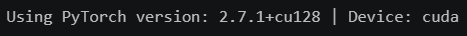
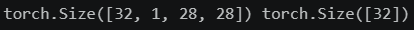
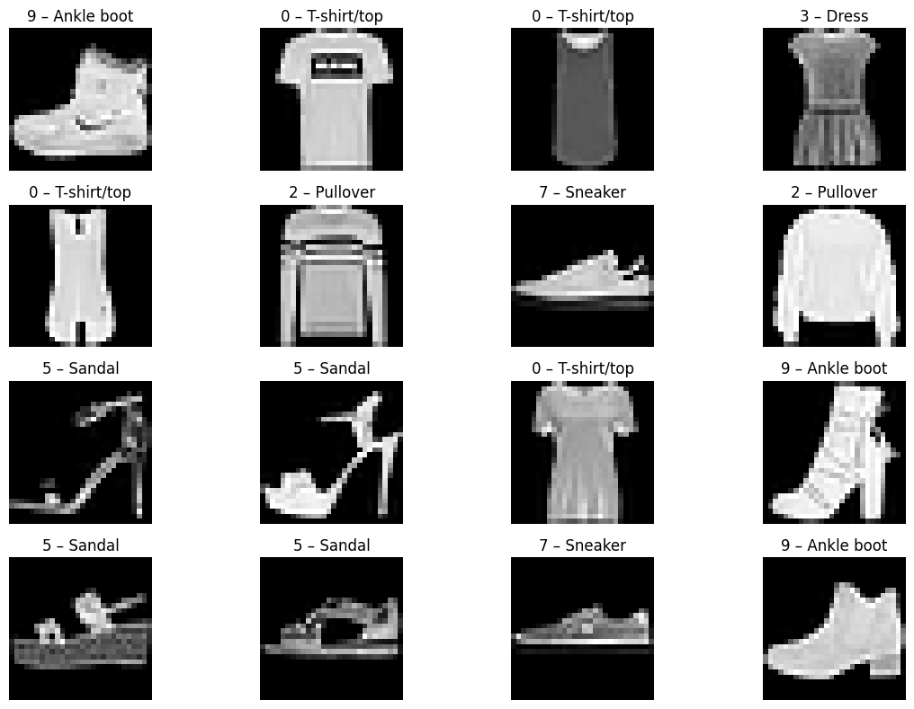
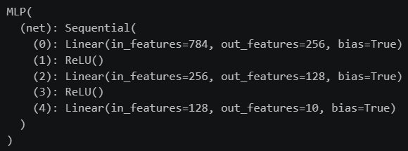
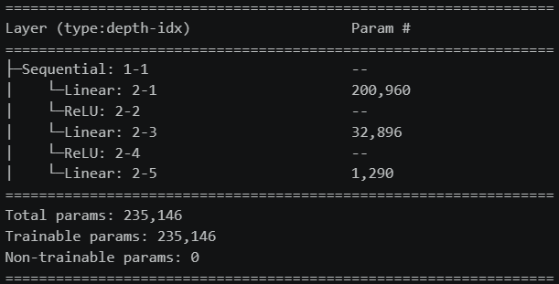
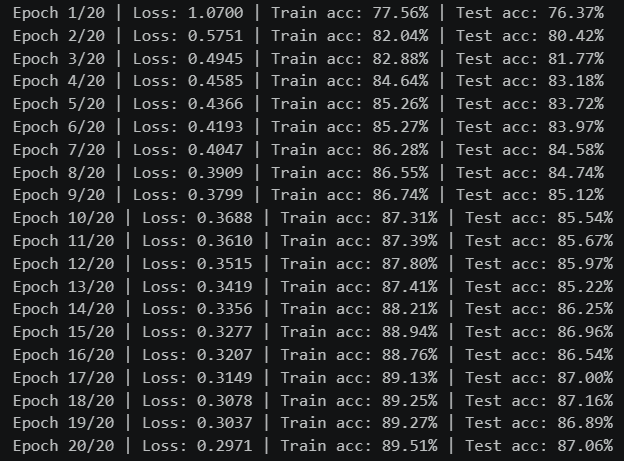
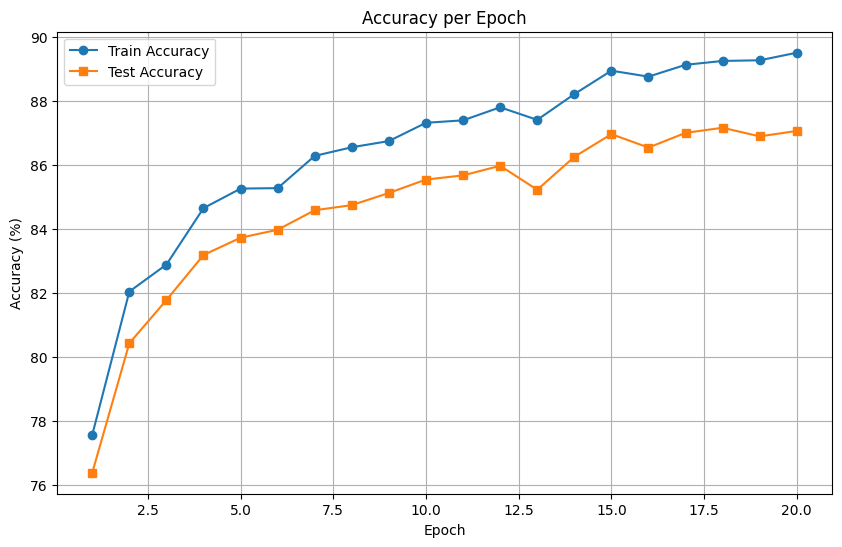
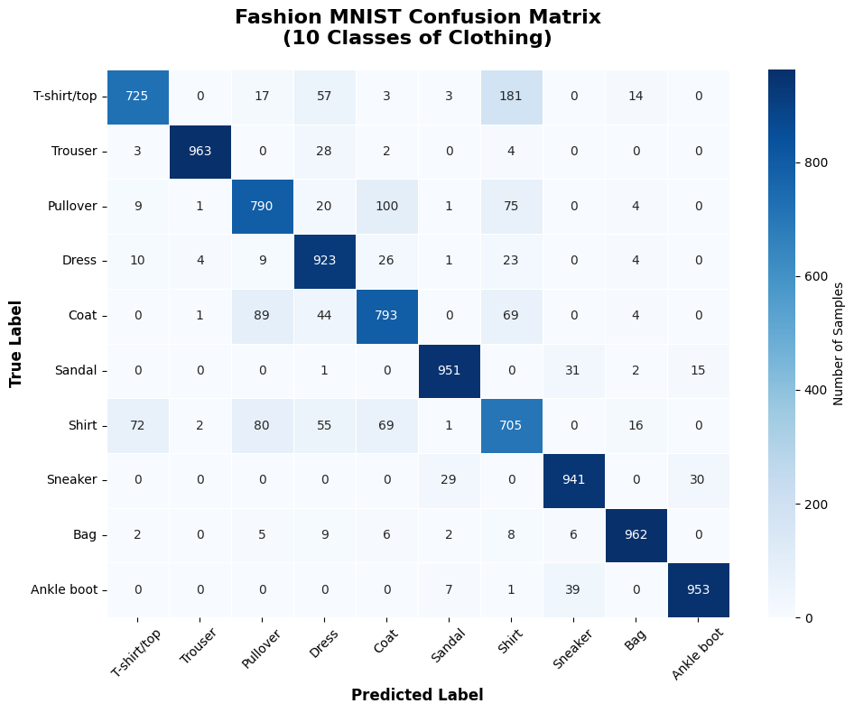
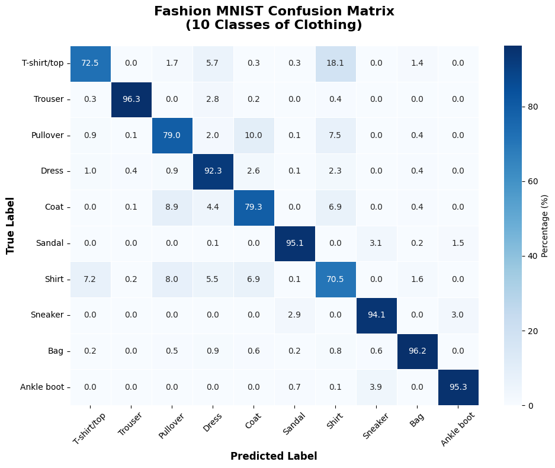
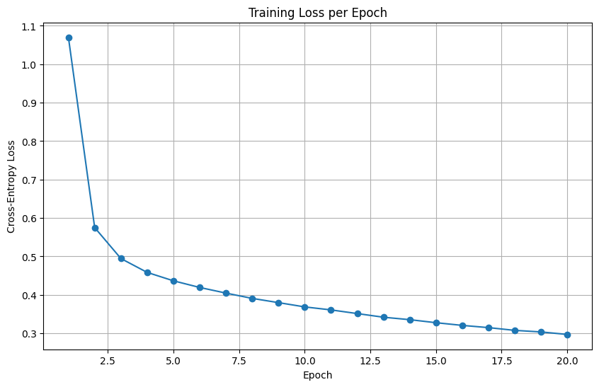

# 🧠 Fashion-MNIST Classification with PyTorch


> A PyTorch-based Multilayer Perceptron (MLP) for multi-class image classification on the Fashion-MNIST dataset. The project implements a complete training and evaluation pipeline, supports GPU-accelerated training with CUDA, and uses confusion matrices and training plots to analyze model performance.

## 📖 Overview

This project was originally developed as a university assignment for the `Artificial Intelligence (AI)` course, using Python and PyTorch.

The objective was to implement and train a `Multilayer Perceptron (MLP)` for image classification using the `Fashion-MNIST dataset`. The project focuses on building a fully connected neural network, preparing the dataset using PyTorch `DataLoader`, training the model for multiple epochs, and evaluating its performance on the test dataset.

This repository contains a `refactored version of the original assignment`, featuring cleaner code, improved readability, translated comments and text to English, better organization, CUDA-enabled PyTorch dependencies, and a dedicated `.gitignore`, while preserving the original functionality and requirements.

## 📚 Original Assignment

The original assignment required implementing and training a `Multilayer Perceptron (MLP)` for multi-class image classification using the `Fashion-MNIST dataset`.

The project required:

- Implementing the MLP architecture in PyTorch
- Using the Fashion-MNIST dataset for image classification
- Preparing training and test datasets using PyTorch `DataLoader`
- Training the network for multiple epochs
- Evaluating the model on the test dataset
- Monitoring training and test accuracy
- Analyzing model performance using confusion matrices

## ✨ Features

- 🧠 **Multilayer Perceptron**

  - Custom MLP architecture implemented with PyTorch
  - Two fully connected hidden layers
  - ReLU activation functions
  - 10-class output for Fashion-MNIST image classification

- 🖼️ **Fashion-MNIST Image Classification**

  - Training and test evaluation on the Fashion-MNIST dataset
  - Automatic dataset downloading through `torchvision`
  - Image preprocessing and normalization
  - Mini-batch training using PyTorch `DataLoader`

- ⚡ **GPU-Accelerated Training**

  - CUDA support for NVIDIA GPUs
  - Automatic device selection between CUDA and CPU
  - Training performed on the GPU when CUDA is available

- 📈 **Training and Evaluation**

  - Training loss tracking
  - Training accuracy tracking
  - Test accuracy tracking
  - 20 training epochs
  - SGD optimizer with momentum
  - Cross-entropy loss function

- 🔬 **Model Evaluation**

  - Test accuracy measurement
  - Comparison between training and test accuracy
  - Confusion matrix evaluation
  - Normalized confusion matrix for class-wise performance analysis

- 📊 **Visualization**

  - Fashion-MNIST training sample visualization
  - Training and test accuracy plot
  - Training loss plot
  - Raw confusion matrix
  - Normalized confusion matrix

- 🧮 **Numerical and Visualization Tools**

  - NumPy for numerical operations
  - Matplotlib for plotting and visualization
  - Scikit-Learn for confusion matrix calculation
  - Seaborn for confusion matrix visualization

## 🧠 Model Architecture

The MLP consists of an input layer corresponding to the flattened `28 × 28` Fashion-MNIST images, two hidden layers with ReLU activation, and a final output layer with 10 classes.

| Layer | Configuration |
| ----- | ------------- |
| Input | 784 features |
| Linear | 784 → 256 |
| ReLU | Activation |
| Linear | 256 → 128 |
| ReLU | Activation |
| Linear | 128 → 10 |
| Output | 10 classes |

The model contains a total of **235,146 trainable parameters**.

## 🏗️ MLP Architecture

The following diagram illustrates the high-level architecture of the Fashion-MNIST classification pipeline.

```text
                    Fashion-MNIST Dataset
                             │
                             ▼
                    Data Preprocessing
                             │
                             ▼
                     28 × 28 Grayscale
                             │
                             ▼
                       Flatten Input
                         (784)
                             │
                             ▼
                    ┌─────────────────┐
                    │   Linear Layer  │
                    │    784 → 256    │
                    └────────┬────────┘
                             │
                             ▼
                           ReLU
                             │
                             ▼
                    ┌─────────────────┐
                    │   Linear Layer  │
                    │    256 → 128    │
                    └────────┬────────┘
                             │
                             ▼
                           ReLU
                             │
                             ▼
                    ┌─────────────────┐
                    │   Linear Layer  │
                    │     128 → 10    │
                    └────────┬────────┘
                             │
                             ▼
                       Model Prediction
                             │
                    ┌────────┴────────┐
                    ▼                 ▼
                  Loss             Accuracy
                    │                 │
                    └────────┬────────┘
                             ▼
                     Model Evaluation
                             │
                             ▼
                  Confusion Matrices
```

## 📂 Project Structure

```text
fashion-mnist-mlp-pytorch/
├── .gitignore
├── fashion-mnist-mlp-pytorch.ipynb
├── README.md
├── LICENSE
├── requirements.txt
└── Images/
    ├── 01-cuda-environment.png
    ├── 02-dataset-loading.png
    ├── 03-training-set-examples.png
    ├── 04-mlp-model-architecture.png
    ├── 05-model-summary.png
    ├── 06-training-results.png
    ├── 07-training-test-accuracy.png
    ├── 08-confusion-matrix.png
    ├── 09-normalized-confusion-matrix.png
    └── 10-training-loss.png
```

## 🛠️ Built With

- Python
- PyTorch
- torchvision
- CUDA
- NumPy
- Matplotlib
- Scikit-Learn
- Seaborn
- Jupyter Notebook

## ⭐ Highlights

- Multilayer Perceptron implemented in PyTorch for Fashion-MNIST image classification
- Fully connected architecture with two hidden layers
- `235,146 trainable parameters`
- GPU-accelerated training using CUDA
- Training and test evaluation pipeline implemented with PyTorch
- SGD optimizer with momentum
- Cross-entropy loss function
- Training performed for `20 epochs`
- Final training accuracy of `89.51%`
- Final test accuracy of `87.06%`
- Confusion matrix analysis for all 10 Fashion-MNIST classes
- Normalized confusion matrix for class-wise performance analysis
- Refactored notebook with improved code organization, naming, and readability

## 🎯 Concepts Demonstrated

- **Multilayer Perceptrons (MLP)**
  The project implements a fully connected neural network for image classification on the Fashion-MNIST dataset.

- **Deep Learning with PyTorch**
  PyTorch is used to define the neural network architecture, train the model, and evaluate its performance.

- **Image Classification**
  The model learns to classify Fashion-MNIST images into 10 different clothing categories.

- **Fully Connected Layers**
  Linear layers are used to transform the flattened image representation and learn classification features.

- **Activation Functions**
  ReLU activation functions are used between the fully connected layers to introduce non-linearity.

- **GPU Acceleration**
  CUDA is used to accelerate model training on a compatible NVIDIA GPU.

- **DataLoaders**
  PyTorch `DataLoader` is used to efficiently load and batch the training and test datasets.

- **Optimization**
  Stochastic Gradient Descent (SGD) with momentum is used to optimize the model parameters.

- **Cross-Entropy Loss**
  Cross-entropy loss is used as the training objective for the multi-class classification problem.

- **Accuracy Monitoring**
  Training and test accuracy are tracked throughout the training process.

- **Confusion Matrix Analysis**
  Confusion matrices are used to analyze classification performance across the 10 Fashion-MNIST classes.

- **Model Evaluation**
  The model is evaluated on unseen test data to measure its generalization performance.

## 📊 Results

- Trained for **20 epochs**
- Final training accuracy: **89.51%**
- Final test accuracy: **87.06%**
- Final training loss: **0.2971**
- The model achieves strong classification performance across most Fashion-MNIST classes
- The confusion matrix shows that visually similar clothing categories, such as `T-shirt/top`, `Shirt`, `Pullover`, and `Coat`, account for a significant portion of the classification errors

## 📸 Screenshots

### 1. CUDA Environment

The project verifies the PyTorch version and confirms that CUDA is available for GPU-accelerated training.



---

### 2. Dataset Loading

The Fashion-MNIST dataset is loaded using PyTorch. The screenshot shows the dimensions of the input batch and the corresponding label tensor.



---

### 3. Training Set Examples

A sample batch from the Fashion-MNIST training dataset is visualized, showing example clothing items together with their corresponding class labels.



---

### 4. MLP Model Architecture

The implemented Multilayer Perceptron consists of an input layer with 784 features, two hidden layers with 256 and 128 neurons, and a final output layer with 10 classes.



---

### 5. Model Summary

The model summary displays the architecture and the number of trainable parameters in each layer. The network contains a total of **235,146 trainable parameters**.



---

### 6. Training Results

The training output shows the loss, training accuracy, and test accuracy for each of the 20 training epochs.



---

### 7. Training and Test Accuracy

The accuracy plot shows the evolution of training and test accuracy across the 20 training epochs.



---

### 8. Confusion Matrix

The confusion matrix shows the number of predictions for each Fashion-MNIST class and highlights the classification performance across the 10 clothing categories.



---

### 9. Normalized Confusion Matrix

The normalized confusion matrix presents the classification results as percentages, making it easier to compare performance across the different Fashion-MNIST classes.



---

### 10. Training Loss

The training loss plot shows the decrease in cross-entropy loss throughout the 20 training epochs.



## 🚀 Running

1. Clone the repository.

```bash
git clone <repository-url>
cd fashion-mnist-mlp-pytorch
```

2. Create and activate a Python virtual environment.

```bash
python -m venv .venv
```

On Windows:

```bash
.venv\Scripts\activate
```

3. Install the required dependencies.

```bash
pip install -r requirements.txt
```

4. Open `fashion-mnist-mlp-pytorch.ipynb` in `Visual Studio Code` with the Jupyter extension installed.

5. Select the project's `.venv` Python environment as the Jupyter kernel.

6. Run the notebook cells in order, or use `Run All`.

The notebook will automatically:

- Download the Fashion-MNIST dataset if it is not already available.
- Load and preprocess the training and test datasets.
- Display sample training images.
- Create and summarize the MLP model.
- Train the model for 20 epochs.
- Evaluate the model on the test dataset.
- Generate training and test accuracy plots.
- Generate raw and normalized confusion matrices.
- Generate the training loss plot.

## 📄 License

This project is released under the **MIT License**.

See the [LICENSE](LICENSE) file for more details.
